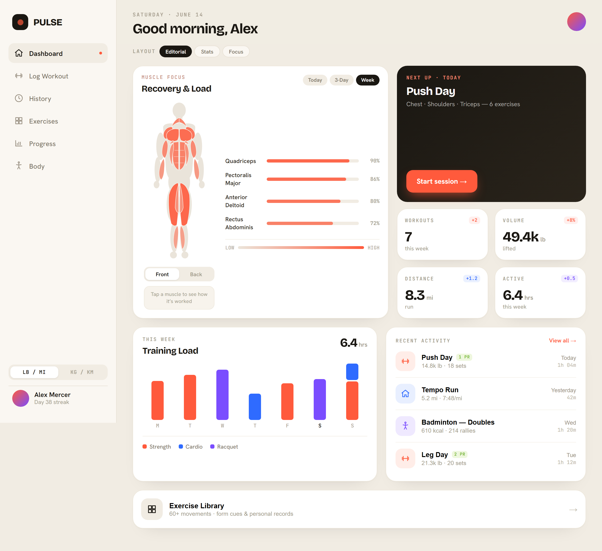

# Pulse — Fitness Tracker

Pulse is a clean, editorial fitness tracker. Log strength, cardio and racquet
sessions, watch how each session loads your muscles, follow strength and volume
progress, and track body metrics over time.

Built with **Next.js (App Router) + TypeScript + Tailwind**, backed by
**Supabase** (Postgres, Auth, Row-Level Security), and deployed on **Vercel**.



## Features

- **Dashboard** — muscle-load body map (computed from your recent training),
  weekly stats vs. last week, training-load bars, recent activity.
- **Log Workout** — strength logger with weight/rep steppers, set completion,
  a rest timer, plus quick cardio and racquet entry. Saves to Supabase.
- **History** — every session, monthly summary, 2-week activity strip, filters,
  and per-session detail (strength / run splits / match score).
- **Exercises** — 60+ movement library with search, categories and your bests.
- **Progress** — personal records, 12-week volume trend, estimated-1RM
  progression, weekly sets per muscle.
- **Body** — weight trend with goal progress, composition, tape measurements,
  and one-tap weight logging.
- Imperial / metric toggle throughout, fully responsive (mobile + desktop).

## Tech

| Layer    | Choice                                   |
| -------- | ---------------------------------------- |
| Frontend | Next.js 15, React 19, TypeScript, Tailwind |
| Backend  | Supabase (Postgres + Auth + RLS)          |
| Auth     | Email + password                          |
| Hosting  | Vercel                                     |

## Local development

```bash
npm install
cp .env.example .env.local   # fill in your Supabase URL + publishable key
npm run dev                  # http://localhost:3000
```

Environment variables (`.env.local`):

```
NEXT_PUBLIC_SUPABASE_URL=https://rejcmfkdqlkhdtosxpmm.supabase.co
NEXT_PUBLIC_SUPABASE_ANON_KEY=sb_publishable_xxx
```

## Database setup

The schema lives in `supabase/migrations/`. Apply it to your project one of
two ways:

**A. Supabase CLI (recommended)**

```bash
npx supabase login
npx supabase link --project-ref rejcmfkdqlkhdtosxpmm
npx supabase db push
```

**B. SQL editor (fastest one-off)**

Open the Supabase dashboard → SQL Editor → paste the contents of
[`supabase/schema.sql`](supabase/schema.sql) → Run.

What it creates: `profiles`, `exercises` (a seeded global library), `workouts`,
`workout_exercises`, `sets`, `body_metrics`, `body_measurements`, full
row-level-security policies, a trigger that creates a profile for each new user,
and `seed_demo_for_me()` which fills a brand-new account with a realistic
starter dataset on first sign-in.

### Supabase ↔ GitHub integration (branching)

This repo is wired for Supabase's GitHub integration. Because the `supabase/`
directory sits at the **repository root**, leave the integration's **working
directory** as the repo root (`.`) — see the
[Supabase docs](https://supabase.com/docs/guides/deployment/branching/github-integration#set-the-working-directory).
Migrations under `supabase/migrations/` are then applied automatically when
changes are merged.

## Deploy to Netlify

The repo includes [`netlify.toml`](netlify.toml) and works with Netlify's
official Next.js Runtime out of the box.

1. **Netlify → Add new site → Import an existing project** → pick the GitHub
   repo `Rithesh17/fit-check`.
2. Build settings are auto-detected (`npm run build`, publish `.next`). Leave
   them as-is.
3. **Site configuration → Environment variables** — add:
   - `NEXT_PUBLIC_SUPABASE_URL` = `https://rejcmfkdqlkhdtosxpmm.supabase.co`
   - `NEXT_PUBLIC_SUPABASE_ANON_KEY` = your `sb_publishable_…` key
4. **Deploy site.**
5. After the first deploy, copy the Netlify URL into **Supabase → Authentication
   → URL Configuration** (Site URL + Redirect URLs).

CLI alternative:

```bash
npm i -g netlify-cli
netlify login
netlify init        # link the repo to a new/existing site
netlify env:set NEXT_PUBLIC_SUPABASE_URL https://rejcmfkdqlkhdtosxpmm.supabase.co
netlify env:set NEXT_PUBLIC_SUPABASE_ANON_KEY sb_publishable_xxx
netlify deploy --build --prod
```

> Prefer Vercel? It also works zero-config — import the repo, add the same two
> env vars, and deploy.

> For instant sign-up during testing, disable email confirmation under
> **Supabase → Authentication → Providers → Email**. With it on, new users must
> confirm by email before signing in.

## Project layout

```
app/                 routes (auth pages + protected (app) group)
components/           UI shell, charts, body map, page views
  pages/             one view component per screen
lib/                 supabase clients, types, formatters, queries, muscle model
supabase/            config.toml, migrations/, schema.sql
design-ref/          original Pulse design + reference screenshots
scripts/             headless-browser screenshot / verification helpers
```
